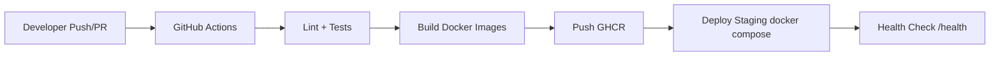

EPREUVE E6 - Chaine CI/CD conteneurisee

Module : Projet Integration et Deploiement Continus
Date : 01/04/2026
Mention : Anonyme
Depot Git : <URL_DU_REPO>

==================================================

SOMMAIRE

1) Partie 1 - Git et gestion de versions
2) Partie 2 - Conteneurisation Docker
3) Partie 3 - Pipeline CI/CD
4) Partie 4 - Orchestration et supervision
5) Partie 5 - Documentation
6) Utilisation de l'IA

==================================================

PARTIE 1 - GIT ET GESTION DE VERSIONS

Exercice 1 - Initialisation et structuration du depot

a) Creation du depot et initialisation
Le depot Git a ete cree sur GitHub/GitLab afin de beneficier d'une plateforme standard de collaboration, d'integration CI/CD native, et d'une bonne tracabilite des changements.

capture 1

b) Strategie Gitflow
Branches creees :
- `main` : branche stable de production.
- `develop` : branche d'integration continue.
- `feature/docker-setup` : branche de fonctionnalite isolee.

Cette strategie permet de separer le code stable, le code en cours d'integration, et les evolutions unitaires, ce qui reduit les regressions.

capture 2

c) Fichier .gitignore et justification
Contenu du .gitignore :

```gitignore
# Dependencies
node_modules/

# Logs
npm-debug.log*
yarn-debug.log*
yarn-error.log*

# Environment variables
.env
.env.*
!.env.example

# OS / IDE
.DS_Store
Thumbs.db
.vscode/
.idea/

# Build / coverage
dist/
coverage/
```

Justifications :
- `node_modules/` : dependances reinstallees via le gestionnaire de paquets.
- `npm-debug.log*`, `yarn-*.log*` : fichiers temporaires non utiles au versioning.
- `.env`, `.env.*` : protection des secrets et variables sensibles.
- `!.env.example` : versionner un modele sans secret.
- `.DS_Store`, `Thumbs.db` : artefacts systeme inutiles.
- `.vscode/`, `.idea/` : preferences locales d'editeur.
- `dist/` : artefacts generes automatiquement.
- `coverage/` : rapports de tests regenerables.

d) Protection de branche main
Regle configuree : interdiction de push direct sur `main`, passage obligatoire par Pull/Merge Request avec controles CI.

Justification : cette regle force une validation systematique, reduit les erreurs humaines, et garantit un historique propre.

capture 3

==================================================

Exercice 2 - Workflow Git et resolution de conflits

a) Creation de deux branches paralleles avec conflit
Depuis `develop`, creation de :
- `feature/add-endpoint`
- `feature/update-health`

Les deux branches modifient la meme zone de `server.js` pour provoquer un conflit controle.

b) Fusion et resolution
1. Fusion de `feature/add-endpoint` dans `develop`.
2. Tentative de fusion de `feature/update-health` dans `develop`.
3. Conflit detecte.
4. Resolution manuelle dans `server.js`.
5. Commit de merge.

capture 4

capture 5

capture 6

capture 7

c) Difference entre merge et rebase
- `git merge` : combine deux historiques en creant un commit de fusion (historique explicite des integrations).
- `git rebase` : rejoue les commits d'une branche au-dessus d'une autre (historique lineaire).

Recommandation :
- `merge` pour integrer des branches partagees en equipe (traite clairement les integrations).
- `rebase` en local avant ouverture de PR/MR pour nettoyer l'historique.

d) Conventional Commits
Convention appliquee (exemples) :
- `feat: add activities endpoint`
- `feat: update health payload`
- `fix: resolve merge conflict in server routes`
- `chore: add gitignore and env example`
- `ci: add github actions pipeline`

Justification : cette convention rend l'historique lisible, facilite les changelogs et la comprehension des intentions de chaque commit.

capture 8

==================================================

PARTIE 2 - CONTENEURISATION DOCKER

Exercice 3 - Dockerfile back-end (multi-stage)

Dockerfile back-end :

```dockerfile
# Multi-stage build: le premier stage sert a tester/construire, le second a livrer une image plus legere et plus sure.
FROM node:20-alpine AS builder
WORKDIR /app
COPY package*.json ./
RUN npm ci
COPY . .
RUN npm test

FROM node:20-alpine AS production
WORKDIR /app
ENV NODE_ENV=production
COPY package*.json ./
RUN npm ci --omit=dev
COPY --from=builder /app/server.js ./server.js
EXPOSE 3000
CMD ["npm", "start"]
```

Pourquoi le multi-stage :
- Stage 1 : inclut outils de test et validation.
- Stage 2 : ne garde que le strict necessaire d'execution.
- Resultat : image plus petite, surface d'attaque reduite, deploiement plus rapide.

Choix image de base : `node:20-alpine`
- plus legere que `node:20`,
- demarrage plus rapide,
- footprint memoire/disque plus faible.

Contenu `.dockerignore` :

```gitignore
node_modules
npm-debug.log
coverage
.git
.env
Dockerfile*
```

Justifications :
- `node_modules` : reinstalles dans l'image.
- `npm-debug.log`, `coverage` : artefacts non necessaires.
- `.git` : historique inutile dans le runtime.
- `.env` : ne pas embarquer de secrets.
- `Dockerfile*` : evite les copies inutiles dans le contexte.

capture 9

capture 10

==================================================

Exercice 4 - Dockerfile front-end + Nginx

Dockerfile front-end :

```dockerfile
FROM nginx:1.27-alpine
COPY index.html /usr/share/nginx/html/index.html
COPY nginx.conf /etc/nginx/conf.d/default.conf
EXPOSE 80
CMD ["nginx", "-g", "daemon off;"]
```

`nginx.conf` :

```nginx
server {
    listen 80;
    server_name _;

    location / {
        root /usr/share/nginx/html;
        index index.html;
        try_files $uri /index.html;
    }

    location /api/ {
        proxy_pass http://backend:3000/;
        proxy_http_version 1.1;
        proxy_set_header Host $host;
        proxy_set_header X-Real-IP $remote_addr;
        proxy_set_header X-Forwarded-For $proxy_add_x_forwarded_for;
        proxy_set_header X-Forwarded-Proto $scheme;
    }
}
```

Role du `proxy_pass` :
- redirige les requetes `/api/*` du front vers le service back-end,
- evite les problemes de CORS en conservant un point d'entree unique,
- simplifie la configuration client.

Justification image Nginx : `nginx:1.27-alpine` pour sa legerete, sa stabilite, et son usage standard en production.

==================================================

Exercice 5 - Docker Compose

`docker-compose.yml` :

```yaml
services:
  backend:
    build: ./backend
    container_name: vitalsync-backend
    env_file:
      - .env
    ports:
      - "3000:3000"
    depends_on:
      - database
    networks:
      - vitalsync-net

  frontend:
    build: ./frontend
    container_name: vitalsync-frontend
    ports:
      - "8080:80"
    depends_on:
      - backend
    networks:
      - vitalsync-net

  database:
    image: postgres:16-alpine
    container_name: vitalsync-db
    environment:
      POSTGRES_DB: ${POSTGRES_DB}
      POSTGRES_USER: ${POSTGRES_USER}
      POSTGRES_PASSWORD: ${POSTGRES_PASSWORD}
    volumes:
      - pgdata:/var/lib/postgresql/data
    ports:
      - "5432:5432"
    networks:
      - vitalsync-net

volumes:
  pgdata:

networks:
  vitalsync-net:
    driver: bridge
```

Reseau personnalise :
- un bridge dedie isole logiquement l'application des autres conteneurs locaux,
- facilite la maitrise des flux inter-services,
- ameliore la lisibilite et la reproductibilite du deploiement.

Volume persistant PostgreSQL :
- conserve les donnees meme si le conteneur est recree,
- sans volume, un `docker-compose down` suivi d'une recreation entraine une perte des donnees.

`.env.example` :

```dotenv
POSTGRES_DB=<db_name>
POSTGRES_USER=<db_user>
POSTGRES_PASSWORD=<db_password>
```

Justification variables :
- `POSTGRES_DB` : nom de la base cible.
- `POSTGRES_USER` : compte d'acces applicatif.
- `POSTGRES_PASSWORD` : mot de passe de connexion.

capture 11

capture 12

==================================================

PARTIE 3 - PIPELINE CI/CD

Exercice 6 - Configuration pipeline

Choix : GitHub Actions
Justification : integration native au depot GitHub, configuration YAML versionnee, execution automatique simple et bien tracee.

Fichier `.github/workflows/ci-cd.yml` :

```yaml
name: vitalsync-ci-cd

on:
  push:
    branches: [develop]
  pull_request:
    branches: [main]

jobs:
  lint-test:
    runs-on: ubuntu-latest
    defaults:
      run:
        working-directory: backend
    steps:
      - uses: actions/checkout@v4
      - uses: actions/setup-node@v4
        with:
          node-version: "20"
      - run: npm ci
      - run: npx eslint . --ext .js
      - run: npm test

  build-push:
    runs-on: ubuntu-latest
    needs: lint-test
    steps:
      - uses: actions/checkout@v4
      - name: Set short SHA
        run: echo "SHA_TAG=${GITHUB_SHA::7}" >> $GITHUB_ENV
      - name: Login registry
        run: echo "${{ secrets.REGISTRY_TOKEN }}" | docker login ghcr.io -u "${{ secrets.REGISTRY_USER }}" --password-stdin
      - name: Build backend
        run: docker build -t ghcr.io/${{ github.repository }}/backend:${{ env.SHA_TAG }} ./backend
      - name: Build frontend
        run: docker build -t ghcr.io/${{ github.repository }}/frontend:${{ env.SHA_TAG }} ./frontend
      - name: Push backend
        run: docker push ghcr.io/${{ github.repository }}/backend:${{ env.SHA_TAG }}
      - name: Push frontend
        run: docker push ghcr.io/${{ github.repository }}/frontend:${{ env.SHA_TAG }}

  deploy-staging:
    runs-on: ubuntu-latest
    needs: build-push
    steps:
      - uses: actions/checkout@v4
      - name: Start staging stack
        run: docker compose up -d --build
      - name: Health check backend
        run: curl --fail --retry 10 --retry-delay 3 http://localhost:3000/health
      - name: Stop staging stack
        if: always()
        run: docker compose down
```

Fonctionnement des etapes :
- `lint-test` : controle qualite et non-regression unitaire avant build.
- `build-push` : construit les images et les publie avec un tag immutable.
- `deploy-staging` : simule un deploiement et verifie la disponibilite API.

Choix registry : GHCR
Justification : integration GitHub native, controle d'acces via secrets, gestion simple des images.

Pourquoi tagger avec le SHA :
- chaque image est reliee a un commit exact (tracabilite),
- rollback plus fiable,
- evite l'ambiguite de `latest`.

Health check :
- interroge `/health`,
- la commande `curl --fail` retourne une erreur si reponse invalide,
- en cas d'echec, le job et la pipeline echouent automatiquement.

capture 13

capture 14

capture 15

capture 16

==================================================

Exercice 7 - Secrets et declencheurs

Secrets configures (exemple) :
- `REGISTRY_USER` : utilisateur registry.
- `REGISTRY_TOKEN` : token d'authentification registry.
- `POSTGRES_PASSWORD` : secret BD pour deploiements.

Pourquoi ne jamais stocker les secrets en clair :
1. **Fuite irreversible** : un secret committe peut etre copie/indexe (forks, miroirs, logs) meme s'il est supprime ensuite.
2. **Compromission systeme** : un attaquant peut pousser des images malveillantes, acceder a la base, ou deployer du code non autorise.

Declencheurs (`on`) :
- push sur `develop` : valider en continu la branche d'integration.
- PR vers `main` : securiser les mises en production avant fusion.

Justification : ce duo couvre a la fois la validation courante et le gate final de stabilite.

capture 17

capture 18

==================================================

PARTIE 4 - ORCHESTRATION ET SUPERVISION

Exercice 8 - Manifestes Kubernetes

`k8s/backend-deployment.yml` :

```yaml
apiVersion: apps/v1
kind: Deployment
metadata:
  name: vitalsync-backend
spec:
  replicas: 2
  selector:
    matchLabels:
      app: vitalsync-backend
  template:
    metadata:
      labels:
        app: vitalsync-backend
    spec:
      containers:
        - name: backend
          image: ghcr.io/<owner>/<repo>/backend:<sha>
          ports:
            - containerPort: 3000
          livenessProbe:
            httpGet:
              path: /health
              port: 3000
            initialDelaySeconds: 10
            periodSeconds: 10
          env:
            - name: POSTGRES_PASSWORD
              valueFrom:
                secretKeyRef:
                  name: vitalsync-db-secret
                  key: postgres-password
```

`k8s/backend-service.yml` :

```yaml
apiVersion: v1
kind: Service
metadata:
  name: vitalsync-backend-svc
spec:
  type: ClusterIP
  selector:
    app: vitalsync-backend
  ports:
    - port: 3000
      targetPort: 3000
```

`k8s/frontend-ingress.yml` :

```yaml
apiVersion: networking.k8s.io/v1
kind: Ingress
metadata:
  name: vitalsync-frontend-ingress
spec:
  rules:
    - host: vitalsync.local
      http:
        paths:
          - path: /
            pathType: Prefix
            backend:
              service:
                name: vitalsync-frontend-svc
                port:
                  number: 80
```

`k8s/db-secret.yml` :

```yaml
apiVersion: v1
kind: Secret
metadata:
  name: vitalsync-db-secret
type: Opaque
data:
  postgres-password: <base64_password>
```

Role des ressources :
- `Deployment` : maintient l'etat desire (pods, replicas, mises a jour).
- `Service` : expose un groupe de pods via une IP stable interne.
- `Ingress` : gere l'acces HTTP entrant depuis l'exterieur.
- `Secret` : stocke des donnees sensibles hors du code applicatif.

Justification de `replicas: 2` :
- `1` replica : pas de haute disponibilite.
- `2` replicas : compromis simple entre resilence et cout.
- `3` replicas : plus resilient mais surdimensionne pour un petit staging.

Liveness probe :
- teste periodiquement `/health`,
- si echec repete, Kubernetes redemarre le conteneur pour restaurer le service.

Choix Ingress :
- preferable pour une exposition HTTP propre, routage evolutif, et mutualisation possible.

Injection du Secret :
- realisee via `env.valueFrom.secretKeyRef`, ce qui evite de mettre le mot de passe en clair dans l'image ou le manifest principal.

==================================================

Exercice 9 - Reflexion supervision

Outils proposes :
- **Prometheus** : collecte de metriques techniques.
- **Grafana** : visualisation et tableaux de bord.
- **Loki/ELK** : centralisation et analyse de logs.
- **Alertmanager** : alertes (mail, Slack, etc.).

Metriques a surveiller :
- CPU et memoire par pod (sante infra).
- Latence API p95/p99 (experience utilisateur).
- Taux d'erreurs 5xx (stabilite applicative).
- Redemarrages de pods (signaux de panne recurrente).
- Saturation DB (connexions, temps de reponse).

Justification : cet ensemble couvre performances, disponibilite, et capacite de diagnostic rapide.

Self-healing Kubernetes :
- le kubelet et le control plane detectent la perte d'un pod,
- le ReplicaSet constate un ecart entre etat courant et etat desire,
- un nouveau pod est automatiquement recree pour revenir au nombre de replicas attendu.

==================================================

PARTIE 5 - DOCUMENTATION

Exercice 10 - README et architecture

README propose (a placer a la racine du depot) :

```markdown
# VitalSync

Application de suivi medical et sportif composee de 3 services :
- backend Node.js/Express (API REST),
- frontend statique servi par Nginx,
- base PostgreSQL.

## Architecture
Frontend (Nginx) -> Backend (Express) -> PostgreSQL

## Prerequis
- Docker >= 24
- Docker Compose v2
- Git >= 2.40
- Node.js 20 (uniquement si execution hors Docker)

## Lancement local
```bash
docker compose up --build
```

Acces :
- Frontend : http://localhost:8080
- Backend health : http://localhost:3000/health

## Pipeline CI/CD
- Lint + tests backend
- Build et push des images Docker taggees par SHA
- Deploiement staging simule + health check bloquant

## Choix techniques
- Node 20 alpine : image legere et stable.
- Nginx alpine : server statique performant avec proxy API.
- GHCR : registry integre a GitHub.
- Tag SHA : tracabilite et rollback fiable.

## Schema Mermaid

```

capture 19

==================================================

UTILISATION DE L'IA

Outil utilise : assistant IA dans Cursor.  
But : accelerer la structuration du rapport, verifier la couverture de tous les attendus du sujet, et reformuler des justifications techniques de maniere claire.

Prompt principal utilise :
`"Construis un rendu complet E6 CI/CD en markdown, avec toutes les sections du sujet et des placeholders capture 1, capture 2, etc., plus des justifications courtes pour chaque choix."`

Adaptations realisees :
- personnalisation des choix d'outils a l'environnement reel du projet,
- ajustement des noms d'images, secrets et URL du depot,
- verification manuelle de la coherence entre le rapport et les fichiers effectivement produits.

Justification de l'usage IA :
- gain de temps sur la structuration documentaire,
- diminution du risque d'oublier un attendu de notation,
- concentration sur la verification technique et les captures de preuve.

==================================================

CHECKLIST FINALE AVANT EXPORT PDF

- Remplacer `<URL_DU_REPO>`, `<owner>`, `<repo>`, `<sha>`, `<base64_password>`.  
- Verifier que tous les extraits de code correspondent exactement a vos fichiers reels.  
- Inserer les images a la place de `capture 1` a `capture 19`.  
- Verifier anonymat (aucun nom/prenom/numero etudiant).  
- Exporter en **un seul PDF** et deposer sur Moodle.
